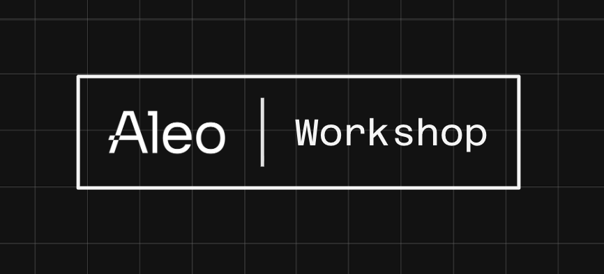

# Frontend Wallet Integration Workshop

This is a workshop for integrating wallets into the frontend of your DApp in the Aleo ecosystem.

# Goal and Takeaways

The goal of this workshop is to show how developers can take full advantage of Aleo’s privacy preserving tech without sacrificing end-user experience (UX).  You'll learn how to integrate existing wallets in the Aleo ecosystem into a frontend app via the universal wallet adapter.

# Getting Started

### Node.js
You'll need to install Node.js v18.0.0+ with the NPM package manager for your chosen operating system.  Head over to the [Node.js](https://nodejs.org/en/download/) website for more information.

Once installed, clone this repository and run `npm install` inside the `project_template` directory.  This will install all necessary packages.

Finally, run `npm run dev` inside the same directory to initialize the development server.  You can view the application's frontend at `http://localhost:5173`.

### Browser Wallets
You'll need to have a browser-based wallet that can access the Aleo Testnet.  We recommend:
- [Leo Wallet](https://www.leo.app/)
- [Puzzle Wallet](https://puzzle.online/)

### Testnet Faucet
You'll also need some Testnet tokens to fund your wallet.  Head over to INSERT_LINK_HERE to acquire some.

### Additional Resources:
- [Aleo Developer Docs](https://developer.aleo.org) 

- [Wallet Adapter Docs](https://docs.leo.app/aleo-wallet-adapter)

- [Aleo Discord](https://discord.gg/aleo)


# Repository Overview
The relevant portions of the repository for this workshop can be found in `project_template/src/` directory.
```
src
├── main.tsx
├── App.tsx
├── App.css
├── custom.d.ts
└── workers
    ├── AleoWorker.ts
    └── worker.ts

```

### `main.tsx`

### `App.tsx` and `App.css`

### `custom.d.ts`

### `workers/`
The `workers/` subdirectory contains backend code from that's necessary for executing Aleo programs and transactions in the browser.  You shouldn't need to edit any of the code in here.  If you're curious to learn about WebWorkers and how this all works, check out the **[Provable SDK](https://docs.explorer.provable.com/docs/sdk/92sd7hgph3ggt-overview)**.


# Frontend

Let's take a look at the application's frontend:


We can see that this application is meant to be a mock token minting and transfer service.  In the backend, it will call a `workshop_token.aleo` program deployed on the blockchain.  This frontend should allow users to connect their browser wallet and intiate transactions that call functions from that program.  For now, users can only connect their wallets.

Mint             |  Transfer
:-------------------------:|:-------------------------:
  |  


# Build

Your task is to fill in the event handler functions in `App.tsx` that will enable the `Mint` and `Transfer` features of the frontend to work properly.


## Task 1A: `handleMintPublic()`
This event handler should call the `mint_public()` function in `workshop_token.aleo` with the proper inputs, form the transaction, then broadcast it using the user's connected wallet.

You'll notice that this function has already been filled in for you.  You should review and understand the code to see how inputs are
parsed and how transactions are formed and broadcast via the wallet adapter.

A few additional notes:
- The order of the inputs in a transaction matters! Check the order of the inputs in the corresponding Aleo program to ensure correct
processing.

- Double check the state hooks at the top of `App.tsx` to see what information is being stored.

- Make sure that your wallet is set to `Testnet Beta` in the app for proper connectivity.

## Task 1B: `handleMintPrivate()`
This event handler should call the `mint_private()` function in `workshop_token.aleo` with the proper inputs, form the transaction, then broadcast it using the user's connected wallet.

Remember to review the provided `handleMintPublic()` function implementation if you get stuck.

### Subtasks:
1. Check that the wallet is connected and functioning 

2. Parse the input fields `Amount` and `Token Record` from their corresponding state hook variables
    - `Token Record` parsing is already implemented for you

3. Set the `mintPrivateLoading()` state hook as `true`

4. Try to form and broadcast the transaction, catching any errors

5. Finally, set the `mintPrivateLoading()` state hook as `false`


## Task 2A: `handleTransferPublic()`

This event handler should call the `transfer_public()` function in `workshop_token.aleo` with the proper inputs, form the transaction, then broadcast it using the user's connected wallet.

Remember to review the provided `handleMintPublic()` function implementation if you get stuck.

### Subtasks:
1. Check that the wallet is connected and functioning 

2. Parse the input fields `Recipient` and `Amount` from their corresponding state hook variables
    - `Recipient` parsing is already implemented for you

3. Set the `transferPublicLoading()` state hook as `true`

4. Try to form and broadcast the transaction, catching any errors

5. Finally, set the `transferPublicLoading()` state hook as `false`


## Task 2B: `handleTransferPrivate()`

This event handler should call the `transfer_private()` function in `workshop_token.aleo` with the proper inputs, form the transaction, then broadcast it using the user's connected wallet.

Remember to review the provided `handleMintPublic()` function implementation if you get stuck.

### Subtasks:
1. Check that the wallet is connected and functioning 

2. Parse the input fields `Recipient`, `Amount`, and `Token Record` from their corresponding state hook variables

3. Set the `transferPrivateLoading()` state hook as `true`

4. Try to form and broadcast the transaction, catching any errors

5. Finally, set the `transferPrivateLoading()` state hook as `false`


